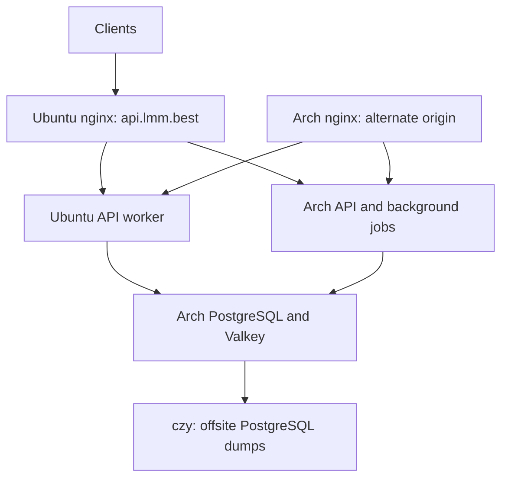

清单核对时间为 2026-09-19。每台主机 1 个虚拟 CPU,可用内存约 950 MiB。这里的测量是对生产安全的短时采样,不是容量或持续存储基准测试。

| 主机 | 检查时可用内存 | 根分区剩余 | CPU 采样(SHA-256 / 16 KiB) | 角色 |
| --- | ---: | ---: | ---: | --- |
| ArchDmit | 388 MiB | 7.8 GiB | 1.69 GB/s | API、单例任务、PostgreSQL、共享 Valkey |
| DmitUbuntu | 712 MiB | 11 GiB | 1.67 GB/s | 公网 nginx 入口与 API 工作进程 |
| archczy | 351 MiB | 11 GiB | 1.97 GB/s | 现有测试安装、状态监控、异地备份 |

两台 DMIT 主机之间往返延迟约 0.38 ms,到 archczy 均约 39 ms。采样小时内共有 164 条消费日志,其中 142 条产生正向扣费,CPU 基本空闲。该设计改善的是请求分布与维护隔离,并不代表存在 CPU 瓶颈。p95 请求耗时 57 秒包含了上游生成与流式传输时间。

## 传输与状态

`packaging/cluster/lmm-api-cluster-tunnel.service` 在 Ubuntu 上运行,使用专用的受限 SSH 密钥。只授权 Ubuntu 的地址和列出的三个转发端点,该密钥无法执行远程命令。已有的 PostgreSQL 隧道仍是独立服务。

| 监听 | 目标 |
| --- | --- |
| Ubuntu `127.0.0.1:5432` | Arch PostgreSQL `127.0.0.1:5432`,已有隧道 |
| Ubuntu `127.0.0.1:16380` | Arch Valkey `127.0.0.1:6380` |
| Ubuntu `127.0.0.1:13001` | Arch API `127.0.0.1:3000` |
| Arch `127.0.0.1:13002` | Ubuntu API `127.0.0.1:3000`,反向隧道 |

两个应用进程必须使用同一个 PostgreSQL 数据库与模式、同一个会话密钥、同一个 Valkey 数据库与凭据。Ubuntu 在读取已有环境文件之后再读取仅 root 可读的 `/etc/lmm-api/cluster.env`,其中设置 `NODE_TYPE=slave` 和带认证的共享缓存地址。不要提交该文件和私有 SSH 密钥。节点名保持为 `arch-dmit` 和 `dmit-ubuntu`。

## Nginx 配置

打包的 HTTP map 声明了 `lmm_api_backend_pool`,包含一个本地 API peer 以及可选的 `/etc/lmm-api/nginx/peers/*.conf` 条目。两个 peer 示例位于 `packaging/cluster`。该池使用加权最少连接和共享失败域。来自 Arch 入口的请求给 Ubuntu peer 权重 2;Ubuntu 入口给每个后端权重 1。

业务请求和边缘访问策略子请求都使用该池。更新已安装的策略时,要保留全部既有的策略请求头、法律与静态路由以及 OAuth 日志过滤。修复脚本从私有暂存目录接收三份完整且已评审的 nginx 配置文件以及 `peer.conf`,随后获取部署锁、拒绝进行中的发布事务、备份现有文件、校验 nginx 并重载。激活失败会还原之前的文件。

`proxy_next_upstream off` 禁止自动重放,包括可计费的 POST 请求。peer 在首次失败后被被动剔除 10 秒,触发该次失败的那个请求仍可能失败。已有流无法在进程之间迁移。SSE 缓冲保持关闭,WebSocket 升级请求头保持不变。回环 3000 端口仍作为本地进程的直接就绪目标。

## 升级与限制

历史 Arch 发布控制器会用公网域名的精确版本与 Arch 软件包版本对比。在该控制器运行前,先把 Ubuntu 的本地池 peer 置为 `down` 以摘除流量,让公网 API 探测落到 Arch。事务确认后,校验两个直接就绪端点,再恢复 Ubuntu 的 peer。不要通过删除事务锁或修改软件包自有文件来绕过完整性校验,系统级 nginx 变更应放在 `/etc`。

较早的发布归档不包含支持池的模板。在这些升级中要保留当前生效的边缘策略;从旧归档完整重装边缘策略会移除集群路由。本次变更中的源模板必须包含在后续软件包中。未来的发布工具应独立探测每个源站,而不是假设公网域名一定指向 Arch。

PostgreSQL、共享 Valkey、后台任务归属和公网 DNS 入口仍是单点。这是应用层负载均衡,不是数据库或站点的自动故障转移。Arch 重启会同时中断两个 API 的数据库访问。不要把 archczy 上独立的测试数据库提升为生产库。

已有的每日 PostgreSQL 备份由 archczy 在 `/var/backups/lmm-api/postgresql/production` 接收。2026-09-19 取得了一次新备份,并用 `pg_restore --file=/dev/null` 检查了归档可完整解码;这不是恢复演练,也不构成恢复时间保证。按日备份意味着最多约 24 小时的数据丢失。带 WAL 保留的异步 PostgreSQL 备库以及经过演练的手动提升流程是单独的下一步工作,不能仅凭逻辑转储声称具备灾难故障转移能力。

## 校验

运行 `node --test scripts/nginx-cluster.test.mjs scripts/nginx-service-errors.test.mjs` 覆盖真实的 nginx 分发、被动失败剔除、写请求不重放、SSE 投递、WebSocket 升级、访问策略失败和 OAuth 日志过滤。安装前运行 `shellcheck scripts/server-repairs/install-cluster-nginx.sh`。激活后检查各进程上的直接 `/api/status`,并抽样公网端点,确认两个后端版本都能被访问,同时没有暴露新的公网后端端口。
