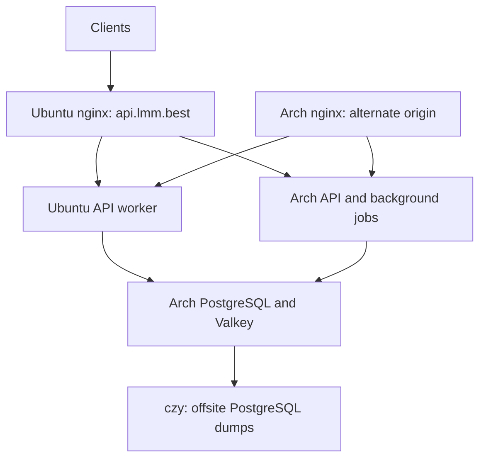

Inventory checked on 2026-09-19. Each host has one virtual CPU and about
950 MiB usable RAM. Measurements are short production-safe samples, not
capacity or sustained storage benchmarks.

| Host | Available RAM at inspection | Root disk free | CPU sample, SHA-256 / 16 KiB | Role |
| --- | ---: | ---: | ---: | --- |
| ArchDmit | 388 MiB | 7.8 GiB | 1.69 GB/s | API, singleton jobs, PostgreSQL, shared Valkey |
| DmitUbuntu | 712 MiB | 11 GiB | 1.67 GB/s | Public nginx ingress and API worker |
| archczy | 351 MiB | 11 GiB | 1.97 GB/s | Existing test installation, status monitoring, offsite backups |

The two DMIT hosts have about 0.38 ms round-trip latency. Both have about
39 ms latency to archczy. The observed hour contained 164 consumption logs;
142 had a positive charge. CPU was mostly idle. This design improves request
distribution and maintenance isolation; it is not evidence of a CPU bottleneck.
The 57-second p95 request duration includes upstream generation and streaming.

## Transport and state

`packaging/cluster/lmm-api-cluster-tunnel.service` runs on Ubuntu with a
dedicated, restricted SSH key. Only Ubuntu's address and the three listed
forwarding endpoints are authorized. The key cannot execute remote commands.
The existing PostgreSQL tunnel remains a separate service.

| Listener | Target |
| --- | --- |
| Ubuntu `127.0.0.1:5432` | Arch PostgreSQL `127.0.0.1:5432`, existing tunnel |
| Ubuntu `127.0.0.1:16380` | Arch Valkey `127.0.0.1:6380` |
| Ubuntu `127.0.0.1:13001` | Arch API `127.0.0.1:3000` |
| Arch `127.0.0.1:13002` | Ubuntu API `127.0.0.1:3000`, reverse tunnel |

Both application processes must use the same PostgreSQL database/schema,
session secret, and Valkey database/credentials. Ubuntu reads the root-only
`/etc/lmm-api/cluster.env` after its existing environment file. This sets
`NODE_TYPE=slave` and the authenticated shared cache URL. Do not commit that
file or private SSH keys. Node names remain `arch-dmit` and `dmit-ubuntu`.

## Nginx configuration

The packaged HTTP map declares `lmm_api_backend_pool` with a local API peer
and optional `/etc/lmm-api/nginx/peers/*.conf` entries. The two peer examples
are in `packaging/cluster`. The pool uses weighted least connections and a
shared failure zone. The Ubuntu peer receives weight 2 from Arch's ingress;
Ubuntu's ingress gives each backend weight 1.

Business requests and edge access-policy subrequests use this pool. Preserve
all existing policy headers, legal/static routes, and OAuth log filtering when
updating an installed policy. The repair script accepts three complete,
reviewed nginx configuration files plus `peer.conf` in a private staging
directory. It takes the deployment lock, refuses an active release transaction,
backs up existing files, validates nginx, and reloads. A failed activation
restores the previous files.

`proxy_next_upstream off` prevents automatic replay, including billable POSTs.
A failed peer is passively excluded for 10 seconds after one failed request;
the triggering request can still fail. Existing streams cannot migrate between
processes. SSE buffering stays off; WebSocket upgrade headers remain intact.
Loopback port 3000 remains a direct local-process readiness target.

## Upgrades and limitations

The historical Arch release controller compares the public domain's exact
version with the Arch package version. Before that controller runs, drain
Ubuntu by setting its local pool peer `down`, so public API probes reach Arch.
After the transaction is confirmed, verify both direct readiness endpoints
and restore Ubuntu's peer. Do not remove transaction locks or edit package-owned
files to bypass integrity checks. System-level nginx changes belong in `/etc`.

Older release archives do not contain the pool-aware templates. Preserve the
active edge policy during those upgrades; a full edge-policy reinstall from an
older archive will remove the cluster routing. The source templates in this
change must be included in subsequent packages. Future release tooling should
probe each origin independently rather than assume the public domain is Arch.

PostgreSQL, shared Valkey, background job ownership, and the public DNS ingress
are still single points of failure. This is application load balancing, not
automatic database or site failover. An Arch reboot interrupts both APIs'
database access. Do not promote archczy's independent test database as production.

The existing daily PostgreSQL backup is received under
`/var/backups/lmm-api/postgresql/production` on archczy. A fresh backup was taken
on 2026-09-19. Full archive decoding was checked with `pg_restore --file=/dev/null`;
this is not a restore rehearsal and does not establish a recovery-time guarantee.
Daily backups permit up to about 24 hours of data loss. An asynchronous PostgreSQL
standby with WAL retention and a tested manual promotion procedure is a separate
next step; do not claim disaster failover from logical dumps alone.

## Validation

Run `node --test scripts/nginx-cluster.test.mjs scripts/nginx-service-errors.test.mjs`
to exercise real nginx distribution, passive failure exclusion, no write replay,
SSE delivery, WebSocket upgrades, access-policy failures and OAuth log filtering.
Run `shellcheck scripts/server-repairs/install-cluster-nginx.sh` before installation.
After activation, check direct `/api/status` on each process and sample the public
endpoint to confirm both backend versions can be reached without exposing a new
public backend port.

