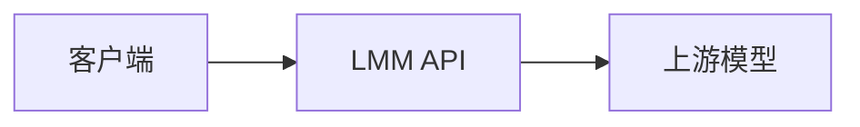

LMM API 位于你的客户端和上游模型之间。它负责协议转换、选择可用路由，并按实际用量扣减额度。



## 一次请求如何完成

1. 客户端把请求发到 `https://api.lmm.best`。
2. 网关读取这枚 API Key 的分组，并在该分组的可用渠道中选择一条路由。
3. 网关按需要把请求转换成上游格式。
4. 上游返回后，网关再转换成客户端期望的格式。
5. 网关按实际用量扣减额度，并写入调用日志。

客户端继续使用 OpenAI、Anthropic 或 Gemini 的原生请求格式。

## 请求进入哪个端点

| 协议 | 入口 | 典型客户端 |
| --- | --- | --- |
| OpenAI Chat | `POST /v1/chat/completions` | 聊天应用、NextChat、LobeChat |
| OpenAI Responses | `POST /v1/responses` | Codex CLI |
| Anthropic Messages | `POST /v1/messages` | Claude Code |
| Gemini | `POST /v1beta/models/{model}:generateContent` | Gemini 客户端、Gemini CLI |
| 嵌入、重排序、审核 | `/v1/embeddings`、`/v1/rerank`、`/v1/moderations` | 检索和审核应用 |
| 媒体 | `/v1/images/*`、`/v1/videos/*`、`/v1/audio/*` | 图像、视频和语音应用 |

端点列表见[接入地址与端点](/docs/api-reference)。参数见侧边栏 **API 参考** 中的生成页面。

## 如何携带 API Key

| 协议 | 请求头 |
| --- | --- |
| OpenAI | `Authorization: Bearer sk-...` |
| Anthropic | `x-api-key: sk-...`，并带 `anthropic-version: 2023-06-01` |
| Gemini | `x-goog-api-key: sk-...`，或查询参数 `?key=sk-...` |

Anthropic 请求也可以使用 `Authorization: Bearer sk-...`。Claude Code 使用这种方式。

## 费用如何计算

额度的内部单位是 quota。换算关系是 **$1 = 500,000 额度**。控制台显示换算后的美元金额。

一次文本请求：

```text
扣费额度 = (输入 tokens + 输出 tokens × 补全倍率 + 缓存 tokens × 缓存倍率) × 模型倍率 × 分组倍率
金额(USD) = 扣费额度 ÷ 500,000
```

| 倍率 | 作用 |
| --- | --- |
| **模型倍率** | 区分不同模型的价格。 |
| **补全倍率** | 放大输出 token 相对输入 token 的价格。 |
| **缓存倍率** | 计算命中提示词缓存的部分。 |
| **分组倍率** | 同一模型在不同分组下的折扣或溢价。 |

图像、视频、音频和重排序按次或按张计费。当前价格见控制台 **模型与价格**，或调用 `GET /v1/pricing?model=<模型ID>`。说明见[模型与价格](/docs/models)。

## 日志里有什么

控制台默认显示调用时间、模型、状态码、token 数和扣费金额。这些记录用于用量展示、路由和风控，你可以在控制台导出。

数据处理规则见[隐私政策](/docs/legal/privacy-policy)。

## 路由如何选择

一个 API Key 可以调用其分组内的全部模型。某条渠道不可用时，网关改用同分组内的其他可用路由。客户端访问 `https://api.lmm.best`，并保留原来的请求协议。
